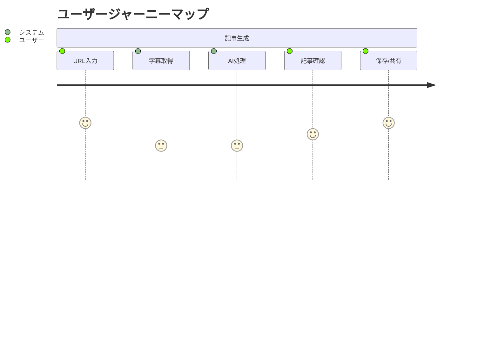

# プロダクトコンテキスト

## ユーザーペルソナ

### プライマリーペルソナ
1. **コンテンツクリエイター**
   - YouTubeチャンネルを運営
   - 動画コンテンツの文字起こしニーズが高い
   - ブログでのマルチチャネル展開を望む

2. **ブロガー/ライター**
   - YouTube動画を記事のソースとして活用
   - 効率的な記事作成プロセスを求める
   - 品質の高い記事生成を重視

### セカンダリーペルソナ
1. **メディア運営者**
   - 大量のコンテンツ生成ニーズ
   - チーム内での共有・管理が必要
   - 一貫した品質管理を重視

## ユーザージャーニー

## ユーザー体験目標
1. **シンプルさ**
   - 最小限の入力で記事生成
   - 直感的なUI/UX
   - クリアな進行状況表示

2. **スピード**
   - 素早い字幕取得
   - 効率的な記事生成
   - レスポンシブな画面遷移

3. **品質**
   - 正確な字幕取得
   - 構造化された記事フォーマット
   - 自然な文章生成

4. **信頼性**
   - 安定したシステム動作
   - エラー時の適切なフィードバック
   - データの永続性保証

## 機能優先順位
### P0（必須機能）
- YouTube URL入力
- 字幕取得
- 記事生成
- 基本的なエラーハンドリング

### P1（重要機能）
- ユーザー認証
- 記事保存
- 進行状況表示
- 基本的な記事フォーマット選択

### P2（追加機能）
- 複数言語対応
- カスタムプロンプト
- 記事プレビュー
- 共有機能

## 品質基準
### コンテンツ品質
1. **記事構造**
   - 明確な見出し階層
   - 適切な段落分割
   - 一貫した文体

2. **内容の正確性**
   - 元動画の主要ポイントを網羅
   - 文脈の適切な解釈
   - 誤訳・誤変換の最小化

### システム品質
1. **パフォーマンス最適化**
   - Server Componentsによる高速な初期表示
     - 3秒以内のページロード
     - ストリーミングレンダリングの活用
   - Server Actionsによる効率的なデータ処理
     - 30秒以内の記事生成
     - 最適化されたデータフェッチ
   - 最小限のクライアントサイドJS
     - 必要な場合のみClient Components使用
     - バンドルサイズの最適化

2. **システム信頼性**
   - サーバーサイドロジックの集中管理
     - サービスレイヤーでの一元的なエラーハンドリング
     - ビジネスロジックの一貫性確保
   - 堅牢なデータ処理
     - Drizzle ORMの型安全性活用
     - トランザクション管理の確実性
   - セキュアな実装
     - Server Componentsでの安全なデータフェッチ
     - Server Actionsでの入力検証

## フィードバックと改善
1. **ユーザー体験モニタリング**
   - Server Componentsのパフォーマンス計測
   - Server Actionsの応答時間追跡
   - ページ遷移の体験評価

2. **システムモニタリング**
   - コンポーネントレベルのパフォーマンス
   - サービスレイヤーのエラー率
   - データフェッチの効率性

3. **継続的改善プロセス**
   - Server Componentsの最適化
   - サービスレイヤーの改善
   - 型安全性の向上
   - アーキテクチャパターンの洗練化
