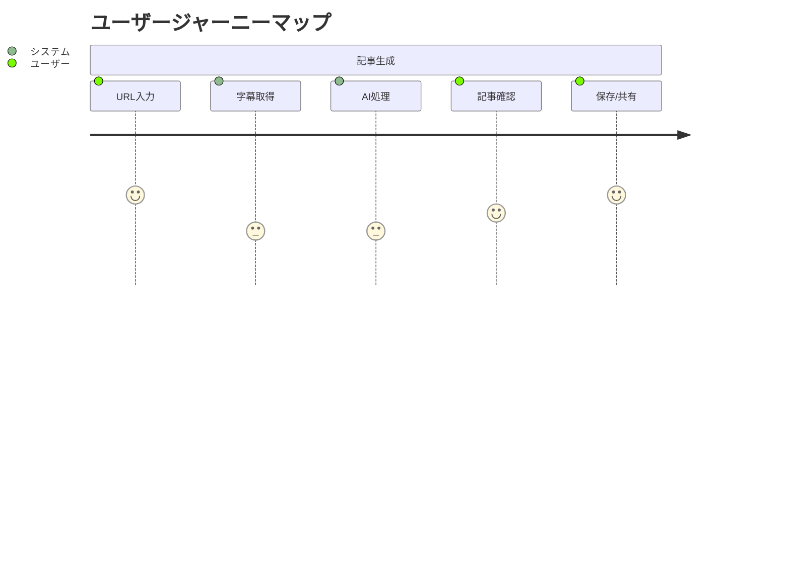

# プロダクトコンテキスト

## ユーザーペルソナ

### プライマリーペルソナ
1. **コンテンツクリエイター**
   - YouTubeチャンネルを運営
   - 動画コンテンツの文字起こしニーズが高い
   - ブログでのマルチチャネル展開を望む

2. **ブロガー/ライター**
   - YouTube動画を記事のソースとして活用
   - 効率的な記事作成プロセスを求める
   - 品質の高い記事生成を重視

### セカンダリーペルソナ
1. **メディア運営者**
   - 大量のコンテンツ生成ニーズ
   - チーム内での共有・管理が必要
   - 一貫した品質管理を重視

## ユーザージャーニー

## ユーザー体験目標
1. **シンプルさ**
   - 最小限の入力で記事生成
   - 直感的なUI/UX
   - クリアな進行状況表示

2. **スピード**
   - 素早い字幕取得
   - 効率的な記事生成
   - レスポンシブな画面遷移

3. **品質**
   - 正確な字幕取得
   - 構造化された記事フォーマット
   - 自然な文章生成

4. **信頼性**
   - 安定したシステム動作
   - エラー時の適切なフィードバック
   - データの永続性保証

## 機能優先順位
### P0（必須機能）
- YouTube URL入力
- 字幕取得
- 記事生成
- 基本的なエラーハンドリング

### P1（重要機能）
- ユーザー認証
- 記事保存
- 進行状況表示
- 基本的な記事フォーマット選択

### P2（追加機能）
- 複数言語対応
- カスタムプロンプト
- 記事プレビュー
- 共有機能

## 品質基準
### コンテンツ品質
1. **記事構造**
   - 明確な見出し階層
   - 適切な段落分割
   - 一貫した文体

2. **内容の正確性**
   - 元動画の主要ポイントを網羅
   - 文脈の適切な解釈
   - 誤訳・誤変換の最小化

### システム品質
1. **パフォーマンス**
   - 3秒以内のページロード
   - 30秒以内の記事生成
   - スムーズな画面遷移

2. **信頼性**
   - 99.9%のシステム稼働率
   - データ永続化の保証
   - セキュアなデータ管理

## フィードバックループ
1. **ユーザーフィードバック**
   - 記事品質評価
   - UI/UX改善提案
   - 機能リクエスト

2. **システムモニタリング**
   - パフォーマンス指標
   - エラー率
   - ユーザー行動分析

3. **継続的改善**
   - AIモデルの調整
   - UI/UXの最適化
   - 新機能の追加
