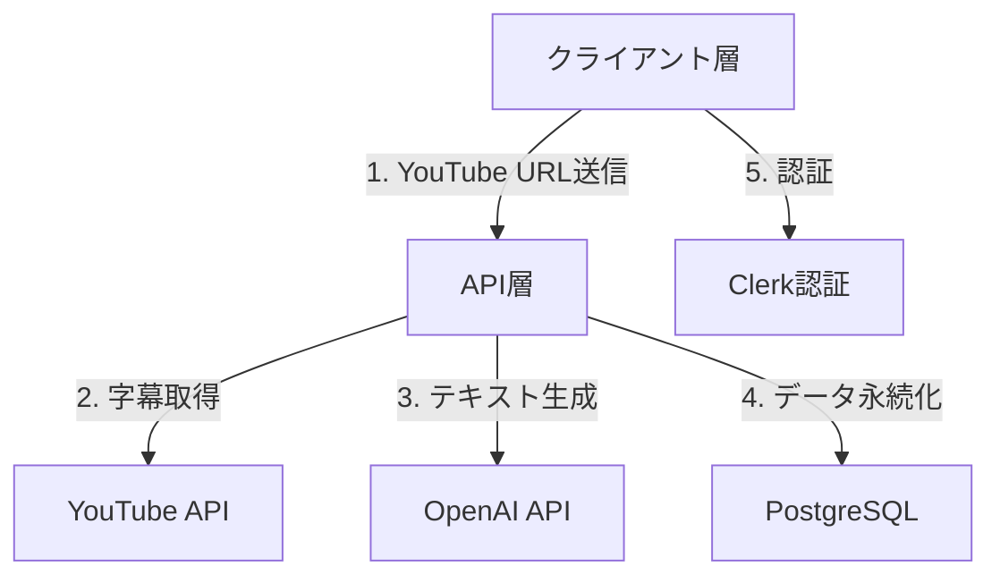
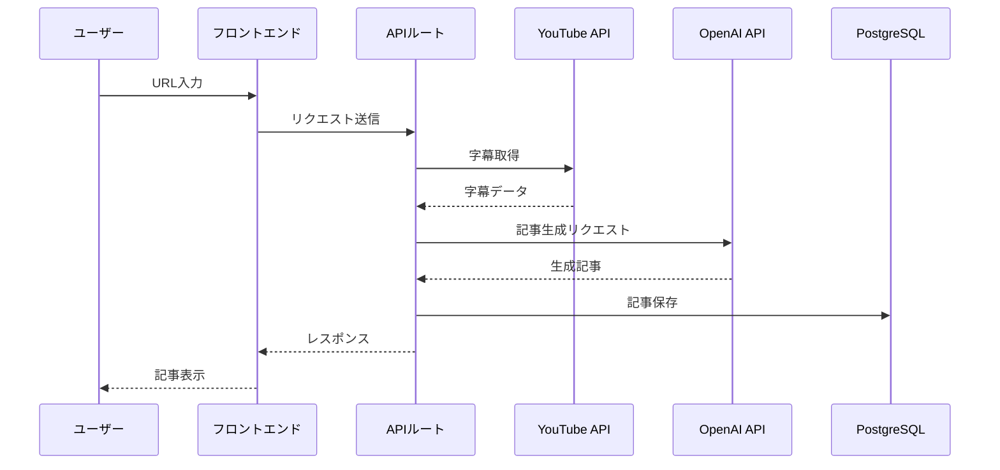

# システムパターン設計

## アーキテクチャ概要

## システムレイヤー
### 1. プレゼンテーション層
- Next.jsによるServer ComponentsとClient Componentsの適切な使い分け
- レスポンシブデザインによるマルチデバイス対応
- プログレッシブエンハンスメントの採用

### 2. アプリケーション層
- APIルートによるサーバーレスファンクションの実装
- リクエスト・レスポンスの標準化
- エラーハンドリングの一元管理

### 3. ドメイン層
- 字幕処理ドメイン
  - 字幕取得
  - テキスト前処理
  - 言語判定
- 記事生成ドメイン
  - プロンプト管理
  - 記事構造化
  - 品質チェック

### 4. インフラストラクチャ層
- Vercelでのサーバーレスデプロイ
- PostgreSQL + Drizzle ORMでのデータ永続化
- Clerkによる認証基盤

## データフロー

## デザインパターン
### 1. Repository Pattern
- データアクセスの抽象化
- Drizzle ORMを使用したリポジトリパターンの実装

### 2. Factory Pattern
- 記事生成プロセスの抽象化
- プロンプトテンプレートの管理

### 3. Strategy Pattern
- 複数言語対応の字幕処理
- 異なる記事フォーマットの生成

### 4. Observer Pattern
- 処理状態の監視
- プログレス表示の実装

## エラーハンドリング戦略
1. **入力バリデーション**
   - URL形式チェック
   - 言語サポートチェック

2. **プロセスエラー**
   - 字幕取得失敗
   - AI生成エラー
   - DB操作エラー

3. **リカバリー手順**
   - 自動リトライ
   - グレースフルデグラデーション
   - ユーザーへのフィードバック

## キャッシング戦略
1. **アプリケーションキャッシュ**
   - 生成済み記事のキャッシュ
   - 字幕データのキャッシュ

2. **APIキャッシュ**
   - YouTube API応答のキャッシュ
   - OpenAI API応答のキャッシュ
