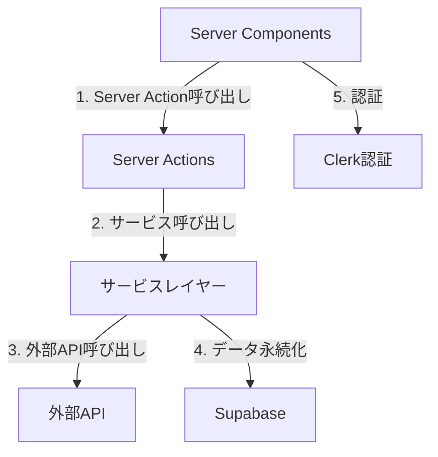
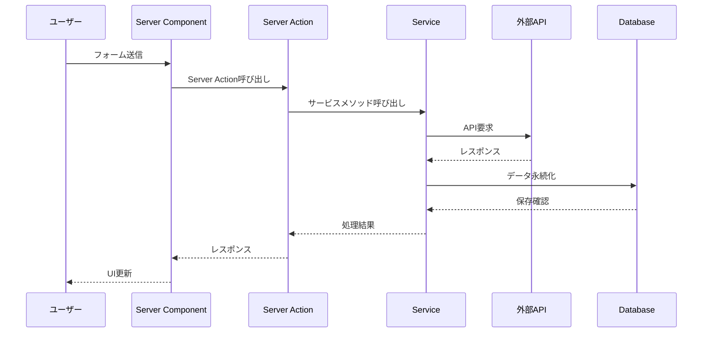

# システムパターン設計

## アーキテクチャ概要


## システムレイヤー
### 1. プレゼンテーション層
- Server Componentsを優先使用
- Client Componentsは必要最小限（例：インタラクティブなUI要素のみ）
- ルートごとに分離されたコンポーネント構造
  - 例：articles/components/
  - 例：dashboard/components/

### 2. サーバーサイド構造
- サーバーロジックの集中管理
  ```
  app/
  ├── (server)/
  │   ├── services/     # ドメインロジック・DB操作
  │   │   ├── articles.ts
  │   │   ├── youtube.ts
  │   │   └── openai.ts
  │   └── actions/      # Server Actions
  │       ├── articles.ts
  │       └── generate.ts
  ```
- Server Actionsによるフォーム処理
- APIルートの最小限使用

### 3. ドメインロジック（サービスレイヤー）
- モデルごとに分離されたサービス
  ```typescript
  // app/(server)/services/articles.ts
  export class ArticleService {
    // Drizzle ORMの型を活用
    async createArticle(data: InsertArticle) {
      return db.insert(articles).values(data);
    }
  }
  ```
- ビジネスロジックの集中管理
- 外部APIとの通信処理

### 4. インフラストラクチャ層
- Vercelでのサーバーレス構成
- Supabaseによるデータ永続化
  - Drizzle ORMによる型安全なクエリ
  - スキーマファーストアプローチ
- Clerkによる認証基盤

## データフロー


## 実装パターン
### 1. Server Component優先パターン
```typescript
// app/articles/page.tsx
export default async function ArticlesPage() {
  // Server Componentで直接データフェッチ
  const articles = await db.query.articles.findMany();
  
  return (
    <div>
      {articles.map(article => (
        <ArticleCard key={article.id} article={article} />
      ))}
    </div>
  );
}
```

### 2. Server Actionパターン
```typescript
// app/(server)/actions/articles.ts
'use server'

export async function createArticle(data: FormData) {
  // サービスレイヤーの呼び出し
  const articleService = new ArticleService();
  return articleService.createArticle({
    // Drizzle ORMの型を使用
    title: data.get('title') as string,
    content: data.get('content') as string,
  });
}
```

### 3. サービスレイヤーパターン
```typescript
// app/(server)/services/articles.ts
export class ArticleService {
  async generateFromYoutube(url: string) {
    const transcript = await this.youtubeService.getTranscript(url);
    const article = await this.openaiService.generateArticle(transcript);
    return this.createArticle(article);
  }
}
```

## エラー処理
```typescript
// app/(server)/services/base.ts
export class BaseService {
  protected handleError(error: unknown) {
    // エラーログ記録
    console.error(error);
    
    // 構造化されたエラーレスポンス
    return {
      success: false,
      error: {
        message: error instanceof Error ? error.message : '不明なエラーが発生しました',
      }
    };
  }
}
```

## キャッシング戦略
1. **React Server Components**
   - デフォルトのキャッシング動作を活用
   - Route Segment Config でのカスタマイズ

2. **Server Actions**
   - クライアントキャッシュの活用
   - 楽観的更新の実装
